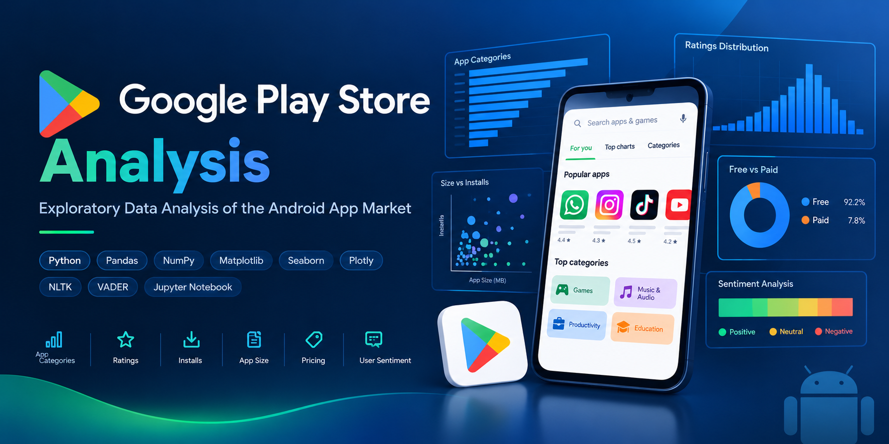
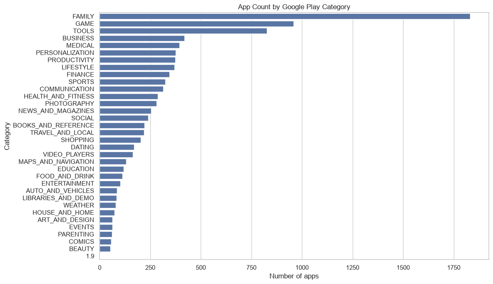
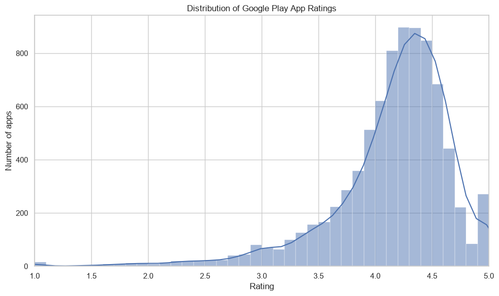
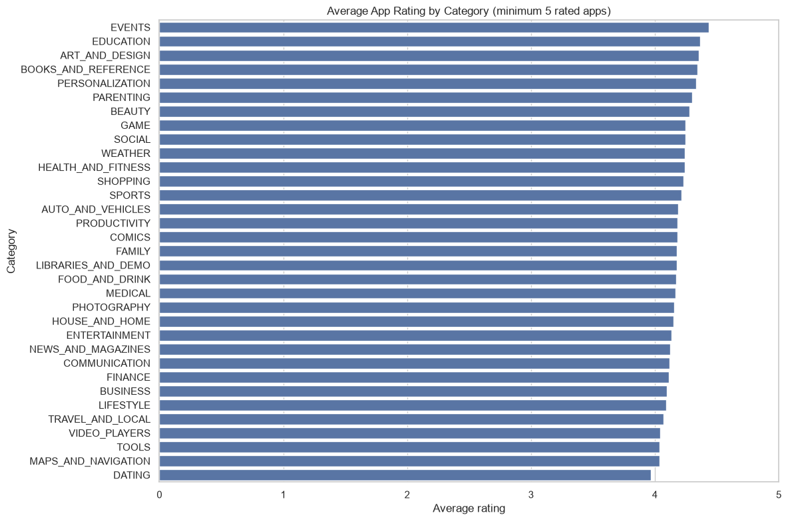
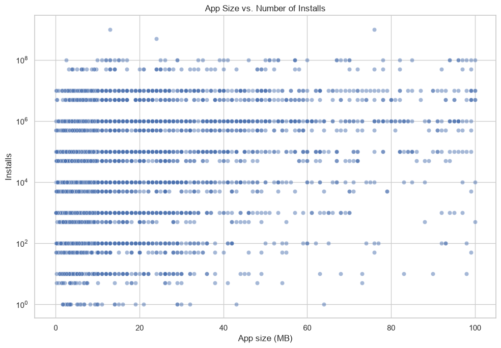
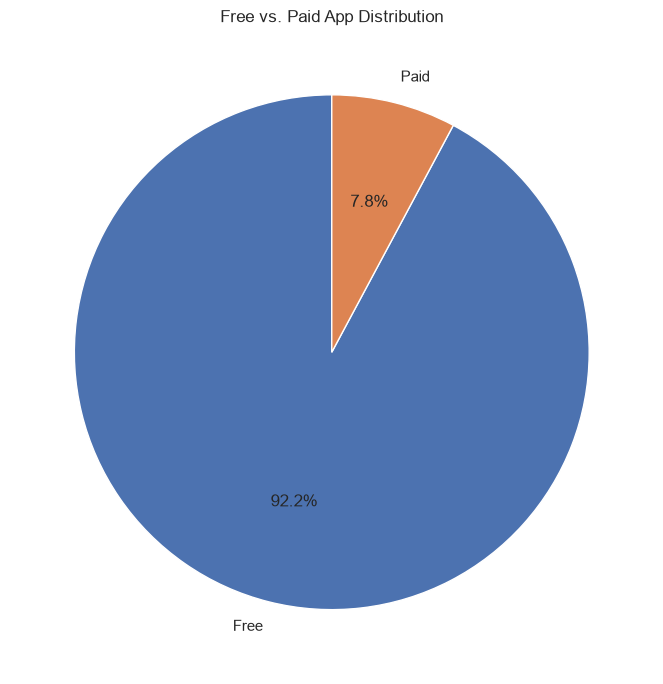
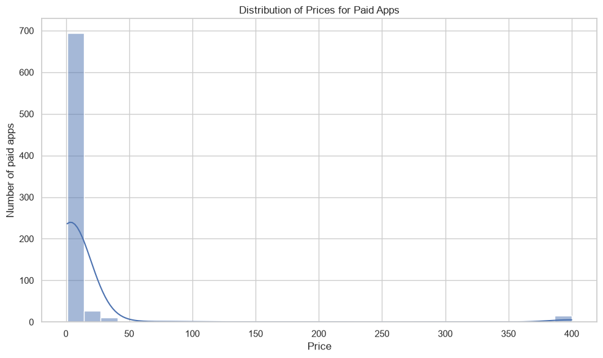
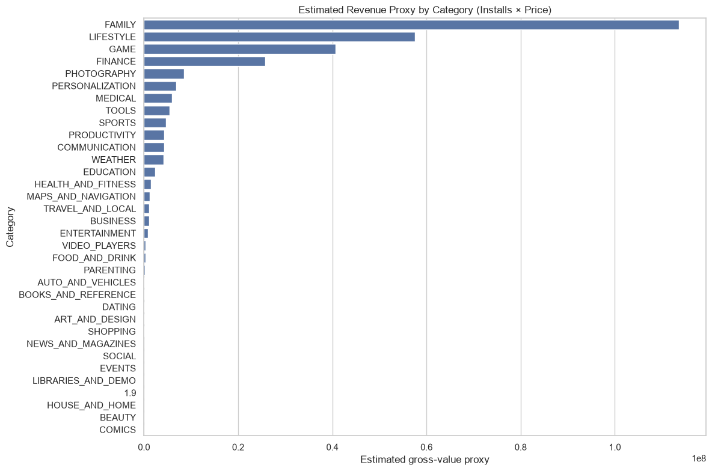
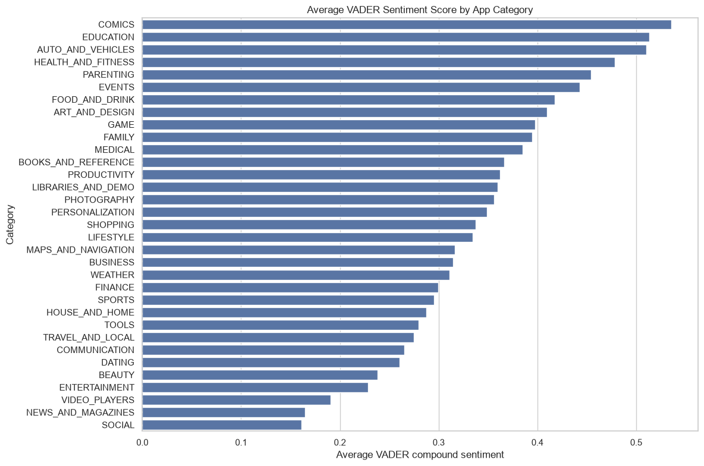
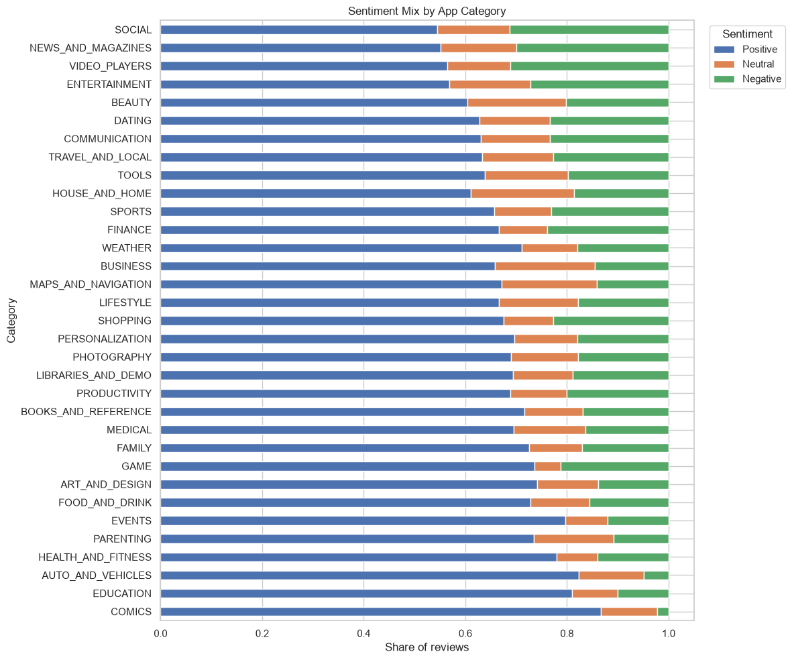

# 📱 Google Play Store Analysis
## 📊 Exploratory Data Analysis of the Android App Market

<p align="center">
  
  
  
  
  
  
  
  
  
</p>

<div align="center">
  
</div>

## 📚 Table of Contents

- [📌 Introduction](#-introduction)
- [📌 What the Project Does](#-what-the-project-does)
- [🌟 Why the Project is Useful](#-why-the-project-is-useful)
- [🎯 Business Questions](#-business-questions)
- [🛠️ Tools and Technologies](#️-tools-and-technologies)
- [📂 Dataset](#-dataset)
  - [📥 Dataset Loading](#-dataset-loading)
  - [🔗 Dataset Source](#-dataset-source)
  - [📊 Dataset Structure](#-dataset-structure)
- [🧹 Data Cleaning and Preparation](#-data-cleaning-and-preparation)
- [🚀 How to Get Started](#-how-to-get-started)
- [📊 Exploratory Data Analysis](#-exploratory-data-analysis)
  - [📈 App Category Analysis](#-app-category-analysis)
  - [⭐ Ratings Analysis](#-ratings-analysis)
  - [📱 App Size vs. Installs](#-app-size-vs-installs)
  - [💰 Pricing Analysis](#-pricing-analysis)
  - [💵 Estimated Commercial Value Proxy](#-estimated-commercial-value-proxy)
  - [🧠 Sentiment Analysis with VADER](#-sentiment-analysis-with-vader)
  - [💬 Sentiment by Category](#-sentiment-by-category)
- [📊 Interactive Visualization](#-interactive-visualization)
- [📌 Key Data-Driven Insights](#-key-data-driven-insights)
- [💼 Business Value](#-business-value)
- [👥 Project Author](#-project-author)

---

## 📌 Introduction

- This project performs an end-to-end **Exploratory Data Analysis (EDA)** of the Google Play Store application market.
- It combines:
  - Structured app metadata.
  - User review text for sentiment analysis.
- The project demonstrates how raw marketplace data can be transformed into:
  - Clean analytical datasets.
  - Data visualizations.
  - Business-oriented insights.
- The dataset is historical, so findings should be interpreted as observations from the analyzed snapshot rather than a description of the current Google Play Store.

---

## 📌 What the Project Does

- Loads app metadata and user-review data into separate Pandas DataFrames.
- Performs data-quality checks using `.info()`, `.head()`, and missing-value audits.
- Cleans and transforms:
  - `Installs`
  - `Price`
  - `Size`
  - `Reviews`
  - `Rating`
- Removes duplicate app records.
- Standardizes category and genre text.
- Analyses category saturation and marketplace composition.
- Analyses ratings and installations.
- Investigates app size versus installation volume.
- Compares free and paid applications.
- Examines paid-app pricing.
- Calculates an exploratory `Installs × Price` gross-value proxy.
- Applies **VADER sentiment analysis** to user reviews.
- Compares sentiment across app categories.
- Produces static Matplotlib/Seaborn visualizations.
- Produces an interactive Plotly visualization.
- Translates findings into developer-focused business insights.

---

## 🌟 Why the Project is Useful

- 📱 **Market Understanding**
  - Shows how applications are distributed across marketplace categories.
- 🏆 **Competitive Analysis**
  - Helps identify highly populated categories that may have stronger competition.
- ⭐ **User Satisfaction**
  - Combines ratings with review sentiment to understand user experience.
- 💰 **Monetization Analysis**
  - Examines free/paid distribution and paid-app pricing.
- 🧠 **NLP Application**
  - Demonstrates how unstructured review text can be incorporated into a data analytics workflow.
- 📊 **Data Storytelling**
  - Converts multiple metrics into visual and business-oriented findings.

---

## 🎯 Business Questions

- Which categories contain the most applications?
- Which categories appear most saturated?
- How are app ratings distributed?
- Which categories have the highest and lowest average ratings?
- Is application size associated with installation volume?
- What proportion of applications are free versus paid?
- How are paid applications priced?
- Which categories have the largest estimated gross-value proxy?
- What is the overall sentiment of user reviews?
- Which categories show stronger or weaker user sentiment?
- How can ratings and sentiment be used together to understand user experience?

---

## 🛠️ Tools and Technologies

| Technology | Purpose |
|---|---|
| **Python** | Core programming and analytical workflow |
| **Pandas** | Data cleaning, transformation, aggregation, and analysis |
| **NumPy** | Numerical operations |
| **Matplotlib** | Data visualization |
| **Seaborn** | Statistical and distribution visualizations |
| **Plotly** | Interactive visualization |
| **NLTK** | Natural Language Processing |
| **VADER** | Rule-based sentiment analysis |
| **Jupyter Notebook** | Analysis development and presentation |

---

## 📂 Dataset

### 📥 Dataset Loading

- The analysis uses:
  - `googleplaystore.csv`
  - `googleplaystore_user_reviews.csv`
- The notebook does **not require Kaggle API credentials**.
- Public copies are loaded from GitHub raw URLs.

#### App metadata URLs

```python
APP_URLS = [
    "https://raw.githubusercontent.com/Shubhi550/The-Android-App-Market-on-Google-Play/master/googleplaystore.csv",
    "https://raw.githubusercontent.com/AisOmar/GooglePlay/master/googleplaystore.csv",
]
```

#### User review URLs

```python
REVIEW_URLS = [
    "https://raw.githubusercontent.com/AisOmar/GooglePlay/master/googleplaystore_user_reviews.csv",
    "https://raw.githubusercontent.com/PeterHassaballah/The-Android-App-Market-on-Google-Play/master/data/googleplaystore_user_reviews.csv",
]
```

- The notebook attempts the URLs in sequence.
- The first successfully loaded source is used.
- If the public sources cannot be retrieved, the notebook uses a **synthetic fallback generator** so that the cleaning and analysis pipeline can still run.
- The synthetic fallback recreates common Play Store data quirks such as:
  - `10,000+`-style install values.
  - `M`, `k`, and `Varies with device` size values.
  - Missing ratings.
  - Duplicate app rows.
  - Missing review text.
  - Free and paid applications.

### 🔗 Dataset Source

- Original dataset: **Google Play Store Apps**.
- Kaggle source:
  - https://www.kaggle.com/datasets/lava18/google-play-store-apps
- The notebook uses public GitHub raw mirrors rather than direct Kaggle API access.
- This avoids requiring a Kaggle API key or local Kaggle configuration.

### 📊 Dataset Structure

#### App-level data

- `App`
- `Category`
- `Rating`
- `Reviews`
- `Size`
- `Installs`
- `Type`
- `Price`
- `Content Rating`
- `Genres`

#### Review-level data

- `App`
- `Translated_Review`
- `Sentiment`
- `Sentiment_Polarity`
- `Sentiment_Subjectivity`

#### Dataset relationship

- The `App` column is used to connect reviews with app metadata.
- This makes category-level review sentiment analysis possible.

---

## 🧹 Data Cleaning and Preparation

### Main cleaning steps

- Inspected dataset structure and data types.
- Audited missing values.
- Removed duplicate application records.
- Converted `Installs` values such as `10,000+` to numeric values.
- Removed commas and plus signs from installation values.
- Converted `Price` to numeric values.
- Removed currency symbols.
- Converted application `Size` into MB.
- Converted `k` values into MB.
- Converted `Varies with device` into missing values.
- Fixed the `Reviews` data type.
- Converted malformed numeric values to missing values instead of allowing the analysis to fail.
- Standardized category and genre text.
- Cleaned review text.
- Excluded missing review text from sentiment scoring.

### Why the cleaning matters

- Numeric analysis requires consistent data types.
- Duplicate records can distort category counts and aggregated metrics.
- Treating `Varies with device` as numeric would introduce incorrect measurements.
- Preserving genuinely missing ratings avoids fabricating user feedback.
- Clean review text provides a more reliable input for sentiment analysis.

---

## 🚀 How to Get Started

### 📦 Step 1: Install Python

- Install **Python 3.11 or later**.
- Verify the installation:

```bash
python --version
```

### 🌱 Step 2: Create a Virtual Environment

- Open a terminal inside the project folder.
- Create the environment:

```bash
python -m venv .venv
```

- Activate it on Windows:

```bash
.venv\Scripts\activate
```

### 📚 Step 3: Install Dependencies

```bash
pip install -r requirements.txt
```

### ▶️ Step 4: Launch Jupyter Notebook

```bash
jupyter notebook
```

### 📓 Step 5: Run the Analysis

- Open:

```text
google-play-store-analysis.ipynb
```

- Run the notebook from top to bottom.
- The notebook performs:
  - Data loading.
  - Data inspection.
  - Data cleaning.
  - Exploratory analysis.
  - Pricing analysis.
  - Sentiment analysis.
  - Category-level analysis.
  - Interactive visualization.
  - Final business conclusions.

---

# 📊 Exploratory Data Analysis

## 📈 App Category Analysis

### App Count by Google Play Category

<div align="center">
  
</div>

### 📌 What the visualization shows

- The chart compares the number of applications across Google Play Store categories.
- **FAMILY** has the largest number of applications in the analyzed dataset.
- **GAME** and **TOOLS** also contain substantially more applications than many other categories.
- The distribution is highly uneven across categories.

### 💼 Business interpretation

- A large category can indicate strong demand.
- It can also indicate stronger competition.
- Category size should therefore not be treated as proof of market opportunity.
- Category size is more useful when evaluated alongside installs, ratings, sentiment, pricing, and competitive positioning.

---

## ⭐ Ratings Analysis

### Distribution of Google Play App Ratings



### 📌 What the visualization shows

- Ratings are concentrated toward the upper end of the **1–5 scale**.
- A large number of applications fall approximately within the **4.0–4.5** range.
- Very low ratings occur less frequently.

### 💼 Business interpretation

- Highly rated applications are common in the dataset.
- User experience and product quality are therefore important competitive considerations.
- Ratings should be interpreted together with review volume because a high rating based on very few reviews may be less informative.

### Average App Rating by Category



### 📌 What the visualization shows

- The chart ranks categories by average application rating.
- Only categories with at least five rated applications are included.
- **EVENTS, EDUCATION, ART_AND_DESIGN, BOOKS_AND_REFERENCE, and PERSONALIZATION** appear toward the higher end.
- **DATING, MAPS_AND_NAVIGATION, and TOOLS** appear closer to the lower end.

### 💼 Business interpretation

- Category-level rating differences can indicate differences in reported user satisfaction.
- Higher average ratings do not automatically imply higher commercial success.
- Review volume, installs, and review sentiment should also be considered.

---

## 📱 App Size vs. Installs



### 📌 What the visualization shows

- The scatter plot compares application size in MB with installation volume.
- The installation axis uses a logarithmic scale because install counts span several orders of magnitude.
- Both relatively small and larger applications can achieve high installation volumes.
- There is no obvious simple visual pattern showing that larger applications consistently receive more or fewer installs.

### 💼 Business interpretation

- Application size alone does not appear sufficient to explain adoption.
- Developers should consider functionality, category, user experience, marketing, brand awareness, and product quality alongside technical size.
- Any statistical association should be interpreted as correlation, not causation.

---

## 💰 Pricing Analysis

### Free vs. Paid Applications



### 📌 What the visualization shows

- Approximately **92.2%** of applications are free.
- Approximately **7.8%** are paid.
- The marketplace sample is therefore strongly dominated by free applications.

### 💼 Business interpretation

- Free-to-download applications are the dominant application type in this dataset.
- Developers may therefore need to evaluate monetization models beyond a simple upfront price.
- Possible models include advertising, subscriptions, and in-app purchases, although this dataset does not directly measure those models.

### Distribution of Prices for Paid Applications



### 📌 What the visualization shows

- Paid-app prices are concentrated toward the lower end of the price range.
- A small number of high-priced applications create a long right-hand tail.
- The distribution is strongly skewed.

### 💼 Business interpretation

- Most paid applications use relatively low listed prices.
- A small number of high-priced outliers can distort the mean.
- Looking at the full price distribution is therefore more informative than relying on average price alone.

---

## 💵 Estimated Commercial Value Proxy



### 📌 What the visualization shows

- The project calculates:

```text
Estimated Gross-Value Proxy = Installs × Listed Price
```

- **FAMILY** has the largest estimated gross-value proxy.
- **LIFESTYLE**, **GAME**, and **FINANCE** are among the next highest categories under this simplified calculation.

### 💼 Business interpretation

- The calculation provides a simple method for comparing potential gross-value scale across categories.
- It is **not actual revenue**.
- It does not account for:
  - Google Play fees.
  - Taxes.
  - Discounts.
  - Refunds.
  - In-app purchases.
  - Subscriptions.
  - Advertising revenue.
  - Conversion rates.
  - Differences between listed price and realized transaction value.
- The measure is therefore intended only for exploratory comparison.

---

## 🧠 Sentiment Analysis with VADER

- User reviews are analyzed as unstructured text.
- **VADER (Valence Aware Dictionary and sEntiment Reasoner)** calculates a sentiment score for each usable review.
- Reviews are classified as:
  - **Positive**
  - **Neutral**
  - **Negative**
- Sentiment is subsequently aggregated to category level.

### Why sentiment analysis?

- Ratings provide a numerical measure of user evaluation.
- Review text provides additional context about what users are expressing.
- Combining both can provide a richer view of user experience.

---

## 📈 Average VADER Sentiment Score by Category



### 📌 What the visualization shows

- The chart compares average VADER compound sentiment across app categories.
- Higher values represent more positive review language on average.
- **COMICS, EDUCATION, and AUTO_AND_VEHICLES** appear toward the higher end.
- **SOCIAL, NEWS_AND_MAGAZINES, and VIDEO_PLAYERS** appear toward the lower end.

### 💼 Business interpretation

- Category-level sentiment highlights differences in how users describe their experiences.
- Lower sentiment can identify categories that may deserve deeper qualitative review.
- Sentiment is best used as a complementary signal rather than a replacement for ratings or retention metrics.

---

## 💬 Sentiment by Category

### Sentiment Mix by App Category



### 📌 What the visualization shows

- The stacked bars show the proportion of:
  - Positive reviews.
  - Neutral reviews.
  - Negative reviews.
- The chart allows comparison of sentiment composition across categories.
- It provides more detail than average sentiment alone.

### 💼 Business interpretation

- Two categories can have similar average sentiment while having different positive/negative mixes.
- A relatively larger negative segment can indicate an area worth investigating further.
- The underlying review text should be examined before making product decisions.

---

## 🔗 Connecting Ratings and Sentiment

| Metric | What it tells us |
|---|---|
| **Average Rating** | Numerical evaluation of an application |
| **Review Count** | Volume of explicit user feedback |
| **VADER Sentiment** | Emotional direction of review language |
| **Sentiment Mix** | Distribution of positive, neutral, and negative reviews |

- Ratings and sentiment should be treated as complementary signals.
- Using structured and unstructured feedback together provides a broader view of user experience.

---

## 📊 Interactive Visualization

- The notebook includes an interactive Plotly category visualization.
- It compares category-level measures including:
  - Number of applications.
  - Total installs.
  - Average rating.
  - Average application size.
- Interactive exploration is available directly inside the Jupyter Notebook.

---

## 📌 Key Data-Driven Insights

### 1️⃣ Free applications dominate the dataset

- **92.2%** of applications are free.
- **7.8%** are paid.
- Free-to-download applications therefore dominate the analyzed marketplace snapshot.

### 2️⃣ Competition is uneven across categories

- **FAMILY** contains the largest number of applications.
- **GAME** and **TOOLS** are also highly populated.
- Developers entering highly populated categories should pay close attention to differentiation and positioning.

### 3️⃣ High ratings are common

- Most ratings are concentrated around approximately **4.0–4.5**.
- The market contains many highly rated applications.
- Product quality and user satisfaction should therefore be treated as important competitive factors.

### 4️⃣ App size alone does not explain adoption

- Both smaller and larger applications achieve high install counts.
- App size alone is therefore unlikely to explain installation success.

### 5️⃣ User sentiment adds another analytical dimension

- VADER sentiment varies across categories.
- Review sentiment complements numerical ratings by analysing the language used by users.

---

## 💼 Business Value

### 👨‍💻 App Developers

- Evaluate category competition.
- Benchmark ratings.
- Explore pricing patterns.
- Understand user sentiment.
- Identify potential product-improvement areas.

### 📦 Product Managers

- Combine ratings and sentiment to understand user experience.
- Compare category-level satisfaction.
- Investigate potential product-quality issues.

### 📣 Marketing Teams

- Explore categories with strong installation volumes.
- Examine user sentiment patterns.
- Compare marketplace segments.

### 📊 Business Analysts

- Combine structured and unstructured datasets.
- Build exploratory market analyses.
- Communicate findings through visualizations.
- Translate analytical results into business-focused insights.

---

## 👥 Project Author

This project has been jointly developed by: **Harsh Mehta** – [harshmehtag524@gmail.com](mailto:harshmehtag524@gmail.com)  

To contribute:
- 💡 Fork the repository  
- 🛠 Create a new feature branch  
- 🔁 Submit a Pull Request (PR)  
- 🐞 Or open an issue on the GitHub repository!
